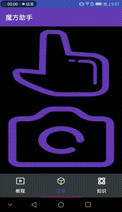

# 编译结果

# 魔方助手

魔方还原应用。已上架[华为应用商城(中国区)](https://appgallery1.huawei.com/#/app/C100958249)

自动识别魔方状态并在3D视图内教你如何快速还原魔方。

## 内容列表

- [背景](#背景)
- [安装](#安装)
- [使用说明](#使用说明)
- [徽章](#徽章)
- [示例](#示例)
- [相关仓库](#相关仓库)
- [维护者](#维护者)
- [如何贡献](#如何贡献)
- [使用许可](#使用许可)

## 背景

`魔方助手` 最开始只是本人在学习机器视觉过程中练手的一个问题。随着后续横向纵向了解到了软件工程，发觉做好一个移动端应用远超个人的开发能力。因此决定陆续开源整个项目。

这个仓库的目标是：

1. 分析产品的需求
2. 根据技术难度和工程量决定实现哪些需求
3. 设计并定义软件架构
4. 交互、UI、编码 开发
5. 各大平台全新上架
6. 接受反馈并优化升级
7. 总结全生命周期并分享

## 安装

应用商店下载并安装[魔方助手](https://appgallery1.huawei.com/#/app/C100958249)

## 使用说明

应用内有教程，按照提示操作。

## 徽章

## 示例

## 相关仓库

- [kociemba](https://github.com/muodov/kociemba) — 三阶魔方还原算法

## 维护者

[@siyaofa](https://github.com/siyaofa)。

## 如何贡献

非常欢迎你的加入！[提一个 Issue](https://github.com/siyaofa/Cube-Helper-X/issues) 或者提交一个 Pull Request。

标准 Readme 遵循 [Contributor Covenant]() 行为规范。

### 贡献者

感谢以下参与项目的人：

## 使用许可

未经本人允许，不得上架各大应用商店、分发应用。

